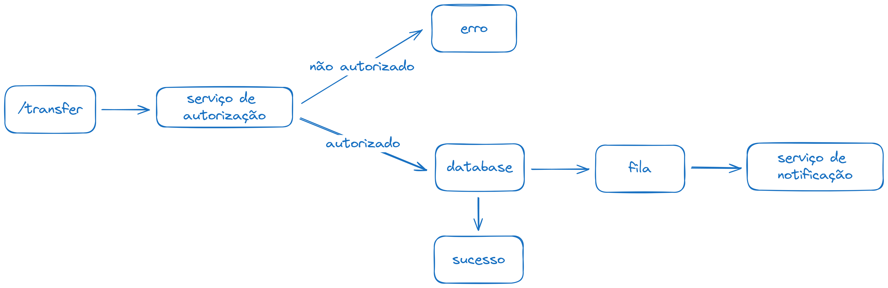

Implementação do [desafio picpay backend](https://github.com/PicPay/picpay-desafio-backend)

### Design & Arquitetura
- Arquitetura Hexagonal
- Domain Driven Design

### Ferramentas
- NestJS
- Typescript
- Prisma
- Postgres
- RabbitMQ
- Docker